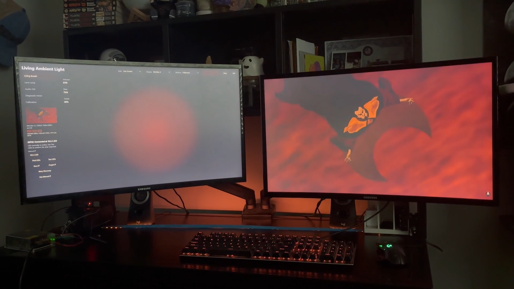

# Living Ambient Light

Living Ambient Light is a Windows Electron desktop app and ESP32-based LED lighting system that creates screen-aware, audio-reactive ambient lighting. Instead of behaving like a traditional equalizer, it uses a Living Breath effect inspired by soft voice-mode interfaces, blending live screen color sampling with audio-driven pulse and shimmer.

## Demo

- [LAL Demo](demo/LAL%20Demo.mp4)
- [LAL Demo 2](demo/LAL%20Demo%202.mp4)

## Screenshots



Additional screenshots:

- [App close-up with purple sync](screenshots/02-app-closeup-purple-sync.png)
- [Pink ambient scene match](screenshots/03-pink-ambient-scene-match.png)
- [Fullscreen monitor effect](screenshots/04-monitor-effect-fullscreen.png)

## Features

- Live display color sampling
- Desktop/display audio analysis
- Volume, bass, mid, and treble detection
- Living Breath LED behavior
- Lava Lamp, Audio Orb, Diagnostic Meter, and Calibration modes
- ESP32 Wi-Fi LED control
- UDP lighting packets
- HTTP `/status` and `/test` endpoints
- Auto-discovery for ESP32
- Manual IP fallback
- Portable Windows build
- Calibration/test controls
- Fullscreen/windowed app mode

## Hardware Used

- Windows PC
- ESP32-S3 DevKit
- WS2812/NeoPixel-compatible LED strip
- External LED power supply
- Shared ground between ESP32 and LED power
- Data pin currently GPIO 2
- LED count currently 60

## Software Stack

- Electron
- JavaScript
- HTML/CSS
- Node.js
- electron-builder
- Arduino IDE
- ESP32 Wi-Fi
- Adafruit NeoPixel
- UDP + HTTP local networking

## How It Works

The Electron app captures a selected display and desktop audio loopback. It samples screen colors to build a mood palette, analyzes audio into volume/bass/mid/treble bands, and sends compact lighting updates to the ESP32 over the local network.

The ESP32 firmware exposes HTTP endpoints for discovery and testing, listens for UDP lighting packets, and renders custom LED modes. The default `living_breath` mode treats the LED strip as one soft organism instead of a per-LED meter.

## Setup Instructions

1. Flash the ESP32 firmware in `esp32_led_visualizer/esp32_led_visualizer.ino`.
2. Edit the firmware Wi-Fi placeholders before uploading.
3. Make sure the PC and ESP32 are on the same Wi-Fi network.
4. Run the app or launch the portable `.exe`.
5. Click `Find LEDs`.
6. Click `Test LEDs`.
7. Use `Living Breath` mode for the main demo.

More detail: [Setup Guide](docs/setup-guide.md)

## ESP32 Firmware Flashing

1. Open `esp32_led_visualizer/esp32_led_visualizer.ino` in Arduino IDE.
2. Install the ESP32 board package.
3. Install the `Adafruit NeoPixel` library.
4. Replace:

```cpp
const char* WIFI_SSID = "YOUR_WIFI_NAME";
const char* WIFI_PASSWORD = "YOUR_WIFI_PASSWORD";
```

5. Confirm `LED_PIN` and `LED_COUNT` match your wiring.
6. Upload to the ESP32-S3.
7. Open Serial Monitor at `115200` baud and note the printed IP address.

## Running From Source

```powershell
npm install
npm start
```

## Building Portable Windows App

```powershell
npm run dist
```

The portable build is written to `dist/`.

## Troubleshooting

See [Troubleshooting](docs/troubleshooting.md).

## Future Improvements

- In-app brightness/gamma/RGB calibration controls
- More polished first-run setup wizard
- Saved hardware profiles
- Demo GIF/video in README
- Optional Home Assistant or MQTT integration

## Resume / Project Summary

Resume bullet:
Built a screen-aware ambient lighting system using Electron, JavaScript, ESP32, UDP networking, and WS2812 LEDs, combining real-time display color sampling with audio analysis to create a Living Breath lighting effect inspired by voice-mode interfaces.

Technical bullet:
Implemented ESP32 auto-discovery, HTTP status endpoints, UDP LED control, portable Windows packaging, and custom firmware modes for live ambient lighting, diagnostics, and calibration.
